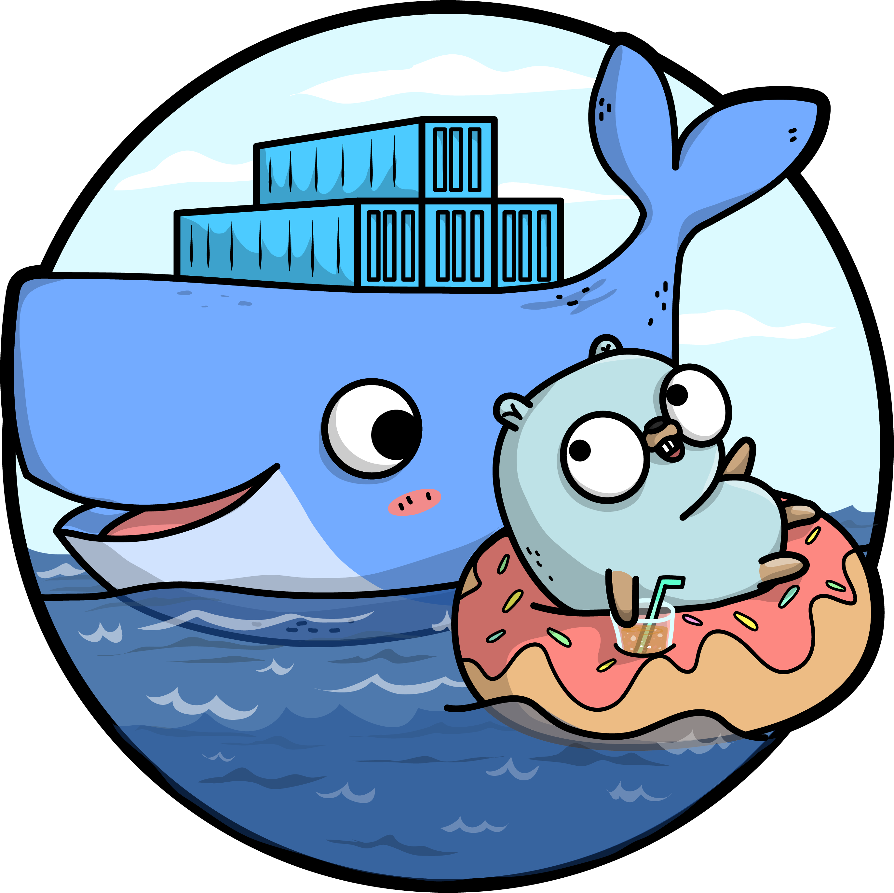

# Container

## Docker




Beispiel eines Go API Service auf Port 8081 ([examples/container](../examples/container)).
```Dockerfile
FROM golang:1.18 AS golang

COPY ./cmd /go/src/opitz-consulting.com/godockerexample/cmd
COPY ./internal /go/src/opitz-consulting.com/godockerexample/internal

WORKDIR /go/src/opitz-consulting.com/godockerexample

RUN go install ./...
RUN CGO_ENABLED=0 go build -o my_service cmd/example/main.go

FROM busybox

COPY --from=golang /go/src/opitz-consulting.com/godockerexample/my_service /app/my_service

EXPOSE 8081
ENTRYPOINT ["./app/my_service"]
```

```
$ docker image ls

REPOSITORY             TAG       IMAGE ID       CREATED          SIZE
go-example-container   latest    26b12691b7ae   27 seconds ago   7.72MB
```

### Links
- [offical go docker image](https://hub.docker.com/_/golang)
- [busybox docker image](https://hub.docker.com/_/busybox)