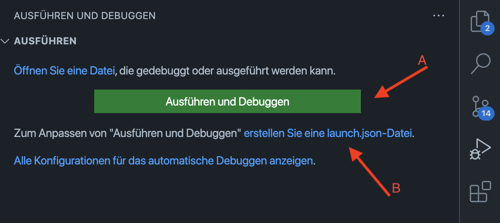

# Compiler, Build & Debug

## Compiler
- Für Go gibt es 2 Compiler
    - gc
    - gccgo
- gc wurde ursprünglich in C geschrieben, seit Version 1.5 nur noch Go und Assembler 
    - gc ist der Standard-Compiler
- gccgo basiert auf GCC
    - compile Zeiten langsamer
    - größere Anzahl an unterstützen Prozessorarchitekturen

### Links
- [Release Notes v1.5](https://go.dev/doc/go1.5#c)
- [Unterschied gc / gccgo](https://stackoverflow.com/a/25811505)
- [gccgo setup](https://go.dev/doc/install/gccgo)

## Build
### Install command
- go install compiliert und installiert packages und dependencies
    - `go install [packages]`
    - `go install ./...`
- mehr details auf: [go.dev](https://go.dev/ref/mod#go-install)

### Build command
- go build compiliert die angegebenen packages / dateien.
    - mit dem Parameter "-o" kann ein Ausgabepfad angegeben werden    
    `go build -o my_binary main.go`
- Cross compiling, durch das Voranstellen der Env Variablen GOOS, GOARCH:
    - `GOOS=windows GOARCH=amd64 go build -o my_binary.exe main.go`
    - mit `go tool dist list` können verfügbare Platformen 
- mehr details auf [go.dev](https://pkg.go.dev/cmd/go#hdr-Compile_packages_and_dependencies)

### Run command
- go run compiliert und führt das angegbene package aus
    - `go run [packages]`   
    - `go run ./...`

## Debugging

### Visual Studio Code

A. main.go bzw. main package öffnen und auf "Ausführen und Debuggen" clicken _oder_   
B. launch.json erstellen und build Konfiguration anlegen:
- Go: launch file auswählen
- Konfiguration nach Belieben anpassen