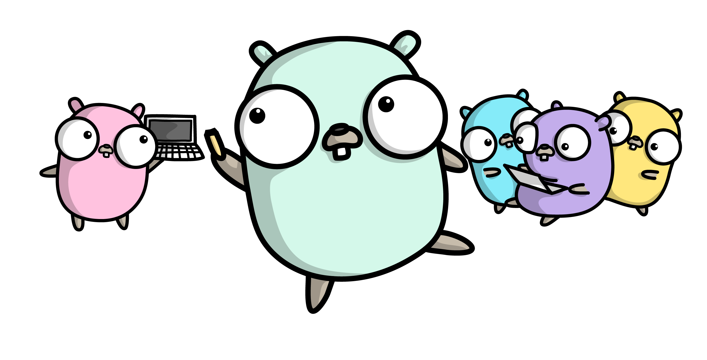

# Go Lernpfad

## Geschichte 
- ursprünglich für den internen Gebrauch bei Google entwickelt
- seit 2009 veröffentlich, seitdem Open-Source
- 2012, Version 1.0 wurde veröffentlicht
- 2015 Go 1.5, C compiler wird durch Go ersetzt

## Warum Go?
- kompilierter Maschinencode -> keine VM
- wenig Komplexität in der Sprache -> einfach zu erlernen
- Performance: [Benchmark Java vs. Go](https://benchmarksgame-team.pages.debian.net/benchmarksgame/fastest/go.html)
- Concurrency

---

## upcoming - advanced
- [ ] Syntax
    - [ ] Concurrency (Goroutines)
    - [ ] Generics
    - [ ] Closures   
    - [ ] Reflection
- [ ] Cgo - go call C code
- [ ] Context 
- [ ] Templating
- [ ] XML / SOAP
- [ ] File IO
- [ ] Testing
    - [ ] Fuzzing
- [ ] Container
    - [ ] Multi Arch Build
    - [ ] Multi Arch Container Image
    
